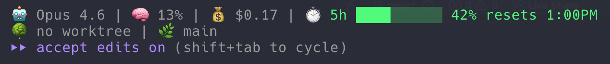

# statusline

A one-line statusline for [Claude Code](https://docs.claude.com/en/docs/claude-code): model, context window, cost, both rate limits, git state, session runtime. Which segments appear, and in which order, is configuration, not a code edit.



```
🤖 Opus 5 T | 🧠 ██████░░ 75% | 💰 $0.42 | ⏱️ 5h ████░░░░ 45% ↻2:30PM | 📁 my-project | 🌿 main +3 ~5 | 🕐 01:23:45
```

Based on [danielmackay/claude-code-statusline](https://github.com/danielmackay/claude-code-statusline), with a single `jq` call instead of ten, POSIX `sh` instead of bash, one-line output, and segments for thinking mode, effort level, both rate limits with reset times, worktree, active agent and session name.

## Install

```
/plugin marketplace add josefheld/claude-plugins
/plugin install statusline@josefheld
```

Then let the skill do it (`"set up my statusline"`), or run the installer yourself:

```sh
sh ~/.claude/plugins/marketplaces/josefheld/plugins/statusline/scripts/install-statusline.sh
```

It points `statusLine` in `~/.claude/settings.json` at the script inside the plugin directory, after backing the file up. Restart Claude Code, the statusline appears.

Requires `jq` (`brew install jq` / `apt-get install jq`) and `git` for the branch segment.

Why point at the plugin instead of copying to `~/.claude`: the copy would go stale. This way `claude plugin update statusline@josefheld` also updates the script.

Which plugin path matters. A marketplace install runs out of `~/.claude/plugins/cache/<marketplace>/<plugin>/<sha>/`, and that `<sha>` is the commit, so it changes with every update and the entry would point at a directory that no longer exists. The installer rewrites it to the marketplace clone at `~/.claude/plugins/marketplaces/<marketplace>/plugins/<plugin>/`, which stays put and is refreshed by the same update. It prints the path it used.

## Configure

Segments are chosen and ordered by `CC_STATUSLINE_SEGMENTS`:

```sh
# only what you need, in the order you want it
sh .../scripts/install-statusline.sh model,context,cost,git
```

| Name | Shows |
|---|---|
| `model` | model, thinking mode (`T`), effort level |
| `context` | context window remaining, as a color bar |
| `cost` | session cost in USD |
| `limits` | 5h and 7d rate limits with reset times |
| `dir` | git repo root name, else the current directory |
| `git` | branch plus staged (`+N`) and modified (`~N`) counts |
| `worktree` | active git worktree name |
| `duration` | session runtime as `HH:MM:SS` |
| `agent` | name of the running subagent |
| `session` | session name, if one is set |
| `style` | output style, unless it is `default` |
| `version` | `claude --version` |
| `codex` | `codex --version` |

Default is all of them. A segment with no data prints nothing, so short sessions have no empty placeholders. Unknown names are ignored instead of breaking the line.

Four more knobs:

| Variable | Default | Meaning |
|---|---|---|
| `CC_STATUSLINE_BAR_WIDTH` | `8` | characters per bar |
| `CC_STATUSLINE_WARN` | `70` | percent used at which a bar turns yellow |
| `CC_STATUSLINE_CRIT` | `90` | percent used at which a bar turns red |
| `CC_STATUSLINE_TIME_FMT` | `%H:%M` | `date` format for the reset time, `%-I:%M%p` gives 12h |

24 hours by default because `%p` is an empty string in most non-English locales, which silently turns `2:30PM` into a bare `2:30`.

All five are environment variables in front of the command, not a config file:

```json
{
  "statusLine": {
    "type": "command",
    "command": "CC_STATUSLINE_SEGMENTS=model,context,git CC_STATUSLINE_BAR_WIDTH=12 sh /Users/you/.claude/plugins/marketplaces/josefheld/plugins/statusline/statusline-command.sh"
  }
}
```

A config file would mean a second `jq` call on every redraw, which is exactly what the single-parse design avoids.

## Installer options

| Command | Effect |
|---|---|
| `install-statusline.sh` | all segments, user settings |
| `install-statusline.sh model,context,git` | only these segments, in this order |
| `install-statusline.sh --project` | writes `.claude/settings.json` in the current repo |
| `install-statusline.sh --show` | prints the current `statusLine` entry |
| `install-statusline.sh --uninstall` | removes the `statusLine` entry |

Every write backs up `settings.json` to `settings.json.bak-<timestamp>` first and refuses to touch a file that is not valid JSON.

## How it works

Claude Code pipes a JSON object into the command on every redraw. The script parses all fifteen fields in one `jq` call via `@sh` plus `eval`, instead of one `jq` per field:

| Field | Used for |
|---|---|
| `model.display_name` | `model` |
| `context_window.remaining_percentage` (or `used_percentage`) | `context` |
| `cost.total_cost_usd` | `cost` |
| `rate_limits.five_hour.used_percentage` / `.resets_at` | `limits` |
| `rate_limits.seven_day.used_percentage` / `.resets_at` | `limits` |
| `workspace.current_dir` | `dir`, `git` |
| `worktree.name` | `worktree` |
| `session_id` | `duration` |
| `session_name` | `session` |
| `agent.name` | `agent` |
| `effort_level` | `model` |
| `output_style.name` | `style` |

Each segment is a `seg_*` function that runs only when its name is in the list, so a disabled segment costs nothing: no `settings.json` read for thinking mode, no `/tmp` write for the session timer, no `claude --version` subprocess.

One locale detail worth knowing, because it silently eats two segments: `printf` and `awk` parse `62.4` according to `LC_NUMERIC`, and in a locale with a decimal comma (`de_AT`, `fr_FR`, ...) that is an `invalid number`. The context bar then reads `0%` in red and the cost prints `$0,42`. The script exports `LC_NUMERIC=C` and leaves `LC_CTYPE` alone, so the numbers parse and the bar characters still render.

## Development

```sh
sh test-statusline.sh
```

Feeds a fixed payload through the script and asserts the segment behaviour: defaults, selection, ordering, bar width, thresholds, unknown names, missing rate limits, empty payload. Run it after every edit.

## Credits

Original script by [@danielmackay](https://github.com/danielmackay). MIT, see the [repo LICENSE](../../LICENSE).
